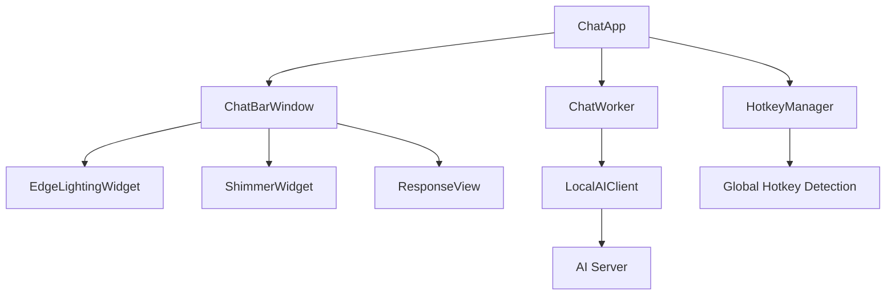

# 🤖 AI Chat Desktop Application

<div align="center">


**A sleek, modern desktop AI chat interface with global hotkey support, streaming responses, and beautiful animations.**

[Features](#-features) • [Installation](#-installation) • [Usage](#-usage) • [Configuration](#-configuration) • [Contributing](#-contributing)

</div>

---

## 📸 Demo

<!-- ### Video Demo
*Coming Soon - Add your demo video here* -->

### Screenshots
*Add screenshots of your application here*

| Main Interface | Thinking Animation | Response Display |
|:--------------:|:-----------------:|:----------------:|
|  |  |  |

---

## ✨ Features

### 🎯 Core Functionality
- **Global Hotkey Access**: Instantly summon the chat window with `Ctrl + Space` from anywhere
- **Streaming Responses**: Real-time AI response streaming with smooth text rendering
- **Auto-hiding Interface**: Automatically hides after interaction for minimal desktop clutter
- **Copy to Clipboard**: One-click response copying with dedicated button

### 🎨 Visual Excellence
- **Modern Dark UI**: Sleek dark theme with rounded corners and transparency
- **Edge Lighting Effects**: Animated glowing borders during typing
- **Shimmer Animation**: Beautiful loading effects during AI processing
- **Smooth Transitions**: Fluid window resizing and fade animations
- **Responsive Design**: Dynamic height adjustment based on content length

### 🔧 Technical Features
- **Local AI Integration**: Works with OpenAI-compatible local servers (LM Studio, Ollama, etc.)
- **Multi-threaded Architecture**: Non-blocking UI with separate worker threads
- **Error Handling**: Robust error handling and user feedback
- **Cross-platform Ready**: Built with PyQt5 for easy cross-platform deployment

---

## 🚀 Installation

### Prerequisites
- Python 3.7 or higher
- A local AI server (LM Studio, Ollama, or any OpenAI-compatible endpoint)

### Method 1: Clone and Install
```bash
# Clone the repository
git clone https://github.com/yourusername/ai-chat-desktop.git
cd ai-chat-desktop

# Install dependencies
pip install -r requirements.txt

# Run the application
python app.py
```

### Method 2: Direct Download
1. Download the latest release from the [Releases](../../releases) page
2. Extract the archive
3. Install dependencies: `pip install -r requirements.txt`
4. Run: `python app.py`

### Dependencies
```
openai>=1.0.0
PyQt5>=5.15.0
keyboard>=0.13.5
requests>=2.25.0
```

---

## 💻 Usage

### Quick Start
1. **Start your local AI server** (LM Studio, Ollama, etc.) on `http://127.0.0.1:1234`
2. **Run the application**: `python app.py`
3. **Use the global hotkey**: Press `Ctrl + Space` to open the chat window
4. **Type your question** and press `Enter`
5. **Watch the magic happen** with streaming responses and beautiful animations

### Global Hotkey
- **`Ctrl + Space`**: Toggle chat window visibility
- **`Enter`**: Send message
- **`Escape`**: Hide window (when focused)

### Interface Elements
- **Input Bar**: Type your questions here
- **Response Area**: Displays AI responses with markdown support
- **Copy Button**: Appears after responses, click to copy to clipboard
- **Edge Lighting**: Glows while typing to indicate activity

---

## ⚙️ Configuration

### AI Server Configuration
Edit `api/client.py` to customize your AI server settings:

```python
class LocalAIClient:
    def __init__(self, base_url="http://127.0.0.1:1234/v1"):
        self.client = OpenAI(base_url=base_url, api_key="not-needed")
        self.model = "llama-3.2-1b-instruct"  # Change to your model
```

### Hotkey Customization
Modify the hotkey in `app.py`:
```python
def check_hotkey(self):
    # Change these values for different hotkeys
    ctrl_pressed = ctypes.windll.user32.GetAsyncKeyState(0x11) & 0x8000
    space_pressed = ctypes.windll.user32.GetAsyncKeyState(0x20) & 0x8000
```

### Visual Customization
Customize the appearance by editing `ui/styles.qss`:
- Colors and themes
- Border radius and shadows
- Font sizes and families
- Animation timing

---

## 📁 Project Structure

```
ai-chat-desktop/
├── 📁 api/                    # AI client and API handling
│   ├── __init__.py
│   └── client.py              # OpenAI-compatible client
├── 📁 ui/                     # User interface components
│   ├── __init__.py
│   ├── ui_manager_chat.py     # Main chat window
│   ├── edge_lighting_widget.py # Edge lighting effects
│   └── styles.qss             # Stylesheets
├── 📁 tasks/                  # Task management utilities
│   ├── __init__.py
│   └── task_manager.py        # Window visibility and handlers
├── app.py                     # Main application entry point
├── requirements.txt           # Python dependencies
└── README.md                 # This file
```

---

## 🔧 Architecture

### Component Overview


### Threading Model
- **Main Thread**: UI rendering and user interactions
- **Worker Thread**: API requests and response streaming
- **Hotkey Thread**: Global hotkey monitoring

### Signal Flow
1. User presses hotkey → Window toggles visibility
2. User types message → Edge lighting activates
3. User presses Enter → Request sent to worker thread
4. Worker streams response → UI updates incrementally
5. Stream completes → Copy button becomes available

---

## 🛠️ Development

### Setting Up Development Environment
```bash
# Create virtual environment
python -m venv venv
source venv/bin/activate  # On Windows: venv\Scripts\activate

# Install dependencies
pip install -r requirements.txt

# Run in development mode
python app.py
```


### Building Executable
```bash
# Install PyInstaller
pip install pyinstaller

# Build executable
pyinstaller --windowed --onefile app.py
```

---

## 🤝 Contributing

We welcome contributions! Here's how you can help:

### Ways to Contribute
- 🐛 **Bug Reports**: Found a bug? Open an issue!
- 💡 **Feature Requests**: Have an idea? We'd love to hear it!
- 🔧 **Code Contributions**: Submit a pull request
- 📖 **Documentation**: Help improve our docs
- 🎨 **Design**: Suggest UI/UX improvements

### Development Guidelines
1. Fork the repository
2. Create a feature branch: `git checkout -b feature/amazing-feature`
3. Commit your changes: `git commit -m 'Add amazing feature'`
4. Push to the branch: `git push origin feature/amazing-feature`
5. Open a pull request

### Code Style
- Follow PEP 8 for Python code
- Use meaningful variable and function names
- Add comments for complex logic
- Write docstrings for classes and methods

---

## 📋 Roadmap

### Version 2.0 (Planned)
- [ ] **Multi-platform Support**: macOS and Linux compatibility
- [ ] **Multiple AI Providers**: Support for more AI services
- [ ] **Conversation History**: Local chat history storage
- [ ] **Custom Themes**: User-selectable color themes
- [ ] **Plugin System**: Extensible plugin architecture

### Version 1.x (Current)
- [x] **Basic Chat Interface**: Core chat functionality
- [x] **Global Hotkey**: System-wide hotkey support
- [x] **Streaming Responses**: Real-time response streaming
- [x] **Visual Effects**: Edge lighting and animations
- [x] **Auto-hide**: Smart window management

---

## 🐛 Troubleshooting

### Common Issues

#### Application won't start
```bash
# Check Python version
python --version  # Should be 3.7+

# Reinstall dependencies
pip install --force-reinstall -r requirements.txt
```

#### Hotkey not working
- **Windows**: Run as administrator for global hotkey access
- **Antivirus**: Whitelist the application
- **Conflicting software**: Check for hotkey conflicts

#### AI server connection failed
```python
# Check server status
curl http://127.0.0.1:1234/v1/models

# Verify server URL in client.py
base_url = "http://your-server:port/v1"
```

#### Window positioning issues
- Clear window settings cache
- Check display scaling settings
- Ensure primary display is set correctly

### Debug Mode
Enable debug mode by setting environment variable:
```bash
export DEBUG=1  # On Windows: set DEBUG=1
python app.py
```

---

## 📜 License

This project is licensed under the MIT License - see the [LICENSE](LICENSE) file for details.

```
MIT License

Copyright (c) 2024 [Your Name]

Permission is hereby granted, free of charge, to any person obtaining a copy
of this software and associated documentation files (the "Software"), to deal
in the Software without restriction, including without limitation the rights
to use, copy, modify, merge, publish, distribute, sublicense, and/or sell
copies of the Software, and to permit persons to whom the Software is
furnished to do so, subject to the following conditions:

The above copyright notice and this permission notice shall be included in all
copies or substantial portions of the Software.
```

---

## 🙏 Acknowledgments

- **OpenAI**: For the API standard that enables local AI integration
- **PyQt5**: For the excellent GUI framework
- **LM Studio**: For making local AI accessible
- **The Open Source Community**: For inspiration and support

---

## 📞 Support

### Get Help
- 📧 **Email**: vinitrajputt@gmail.com
- 🐛 **Issues**: [GitHub Issues](../../issues)

### Show Your Support
If this project helped you, please consider:
- ⭐ Starring the repository
- 🐛 Reporting bugs
- 💡 Suggesting features
- 🤝 Contributing code

---

<div align="center">

**Made with ❤️ by [Vinit Rajput](https://github.com/vinitrajputt)**

*Bringing AI to your desktop, one chat at a time.*

</div>